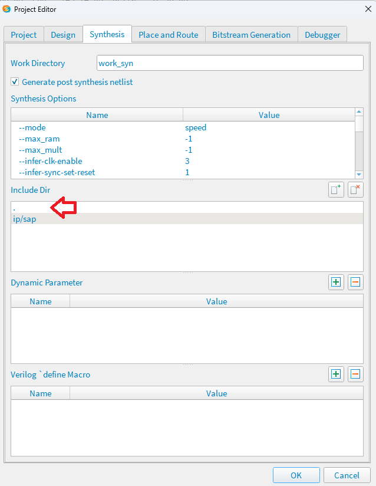

# Trinita 1stage/2stage Core

## 注意

- **本ソースコードの使用にあたり [ライセンス](./LICENSE) に同意頂く必要がございます。**
  - 本リポジトリの一部または全部を Clone / Download した時点で、ライセンス条項に同意したものとみなします。
- 本ドキュメントの pdf 版は [こちら](./README.pdf) です。
- ソフトウェアを Flash Memory に格納し、Bootloader を使用して起動する方法は下記ドキュメントを参照してください。
  - [Bootloader によるソフトウェアの起動](./README_Bootloader.md)


## 概要

このコアは Efinix FPGA Sapphire SoC 向けの 1ステージ / 2ステージ RISC-V コアです。

Efinix Sapphire SoC の Vex RISC-V コアを差し替えて使います。

Efinity の コンパイルパラメータ (STAGE2 マクロ) の定義によって、1ステージ版 or 2ステージ版を選択できます。


## 動作環境

### ハードウェア
- Efinix 社 Trion FPGA または Titanium FPGA

### ソフトウェア
- Efinix 社 Efinity IDE 2022.2~
- Efinix 社 RISC-V IDE
- Python 実行環境

## サンプル

Trinita Core の性能評価用として、各種評価ボード向けの Example Design をご用意しました。

下記フォルダのデザインをダウンロードしてお使いください。

評価ボードですぐに動作確認できる、コンパイル済みのバイナリ (.hex) も同梱しています。

- [T20 BGA256 Development Board 用 1 ステージ Example Design](./example_t20_1stg)
- [T20 BGA256 Development Board 用 2 ステージ Example Design](./example_t20_2stg)
- [Ti60 F225 Development Board 用 1 ステージ Example Design](./example_ti60_1stg)
- [Ti60 F225 Development Board 用 2 ステージ Example Design](./example_ti60_2stg)

## 制約事項

| 項目   | 内容   |
| ------ | ------ |
| 動作時間  | 無償評価版のみ 1 時間 |
| 動作周波数  |  Trion シリーズ : 25MHz <br> Titanium シリーズ : 75 MHz  |
| オンチップメモリ容量  |  64KB (imem 32KB + dmem 32KB)  |
| メモリ先頭アドレス | imem : 0xF900_0000 <br> dmem : 0xF908_0000 |

## 性能参考値

※ Titanium Ti60 Development Board による測定結果
※ 動作周波数は 75 MHz
※ オンチップメモリ容量は 64KB (imem 32KB + dmem 32KB) 

Efinix Sapphire SoC の動作周波数は 20 ~ 400MHz ですが、Trinita Core は実行効率が向上しているため動作周波数を下げています。

動作周波数やメモリ容量のカスタマイズはご相談ください。

#### DMIPS/MHz

※当社比

| コア | キャッシュ | DMIPS/MHz |
| ------ | ------ | ---------- |
| Efinix Sapphire | 無し | 0.86 |
| Efinix Sapphire | 有り | 1.05 |
| Uno Labo 1ステージ Trinita | 無し | 1.44 |
| Uno Labo 2ステージ Trinita | 無し | 1.32 |

#### Efinix FPGA リソース使用量

※ 当社比であり、実装条件によって値は変動します。

| コア | キャッシュ | FFs | LTUs | RAMs |
| ------ | ------ | ---------- | ---------- | ---------- |
| Efinix Sapphire | 無し | 1616 | 2506 | 68 |
| Efinix Sapphire | 有り | 1941 | 2872 | 80 |
| Uno Labo 1ステージ Trinita | 無し | 2028 | 4948 | 64 |
| Uno Labo 2ステージ Trinita | 無し | 1182 | 3201 | 68 |

## Trinita 1stage Core 実装 (差し替え) 手順

※ この手順は、下記の前提条件で説明を進めます。

- 既存デザインに Sapphire SoC が実装済みである
- Sapphire SoC のインスタンス名が sap である

### 1. テンプレートをコピーする

- template フォルダに格納されているファイル・フォルダを、プロジェクトフォルダにコピーします。
- Sapphire SoC のインスタンス名が sap 以外である場合、templete/embedded_sw/sap 配下のフォルダを、お使いのインスタンス名のフォルダ配下にコピーしてください。

### 2. Sapphire SoC ソースコードの VexRiscV コアの Trinita コアに置き換える

1. templete
2. ./ip/sap フォルダの sap.v を ./convtrinita フォルダにコピーします。
3. コマンドプロンプトを開き ./convtrinita フォルダに移動します。
4. 下記コマンドを実行します。このコマンドによって、sap.v の VexRiscV コアが Trinita コアに置き換わります。

```
python sap2tri.py sap.v
```

5. sap.v を ./ip/sap フォルダにコピーします。(上書き)


### 3. トップデザインにクロックを追加する

Trinita コアは、クロックを 2 本使用します。

- io_systemClk  : メインクロック
- io_systemClk2 : メインクロックと同周期の位相をシフトしたクロック

1. トップデザインの入力ポートとして io_systemClk2 を追加します。
2. SoC のインスタンスに io_systemClk2 を接続します。
3. Efinity Interface Designer を開き、PLL に io_SystemClk2 を追加します。

io_systemClk2 の推奨位相は下記のとおりです。
- Trion T20 25MHz : 180 deg
- Titanium Ti60 75MHz : 225 deg

4. constraint.sdc に io_systemClk2 の定義を追加します。

- お使いのデザイン規模・動作周波数に合わせて、io_systemClk - io_systemClk2 間のデータ受け渡しタイミングがミートするように位相を決定します。
- 何度かコンパイルし、timing report (slack) をチェックして、位相を決定します。

### 4. マクロ定義ファイル(trinita_define.vh) を作成する

1. trinita_define.vh をエディタで開き、下記の通りマクロを定義します。

```verilog
`define EFINIX 1
`define FREQ 25
`define SAPPHIRE 1
`define START_ADDRESS 32'hF9000000
`define IMEM_AWIDTH 15
`define DMEM_AWIDTH 15 
`define FILE_IMEM  "./romdata/imem.hex"
`define FILE_IMEM0 "./romdata/imem0.hex"
`define FILE_IMEM1 "./romdata/imem1.hex"
`define FILE_IMEM2 "./romdata/imem2.hex"
`define FILE_IMEM3 "./romdata/imem3.hex"
`define FILE_DMEM  "./romdata/dmem.hex"
`define FILE_DMEM0 "./romdata/dmem0.hex"
`define FILE_DMEM1 "./romdata/dmem1.hex"
`define FILE_DMEM2 "./romdata/dmem2.hex"
`define FILE_DMEM3 "./romdata/dmem3.hex"
`define TRION 1
```

※ デバイスが Titanium のときは TRION マクロを定義しないてください。

2. トップデザインに下記の 1 行を追加します。

```verilog
`include "trinita_define.vh"
```

3. Efinity で File - Edit Project を選択し、include dir に trinita_define.vh の保存場所(フォルダ) を追加します。
この例では、Efinity プロジェクトと同じ場所になるので "." が追加されています。




### 5. RISC-V IDE でソフトウェアを Trinita 用にビルドする

1. RISC-V IDE を起動したら、ワークスペースとして ./embedded_sw/sap を指定します。
2. gpioDemo プロジェクトをインポートします。
3. gpioDemo 配下の makefile と ./src/start.S ファイルの中身が、下記リンクのものと同一であることを確認します。

※ gpioDemo 以外のソフトウェアをビルドする場合、そのソフトウェアのフォルダに、gpioDemo の makefile と ./src/start.S をコピーしてください。

4. gpioDemo を Clean したあと、Build します。
5. gpioDemo/build 配下に imem.bin と dmem.bin が出力されます。
6. imem.bin と dmem.bin を ./romdata にコピーします。
7. コマンドプロンプトを開き、./romdata に移動します。
8. 下記コマンドを実行し、Trinita コアの IMEM / DMEM に埋め込むための初期値ファイル (hex) を生成します。

```
python trinitaHexGen.py imem.bin

python trinitaHexGen.py dmem.bin

```

### 6. Efinity でコンパイルする

1. Efinity で File - Edit Project を選択します。
2. 下記のとおりコンパイルマクロを追加します。 

3. Efinity でコンパイルを実行します。

----

## その他

### Trinita Core を 1stage から 2stage に切り替える

下記のコンパイルマクロを追加することで Trinita Core が 2 ステージ版でコンパイルされます。

```verilog
`define STAGE2 1
```

※ : Trinita Core を 1ステージ版で動作させる場合は STAGE2 マクロを定義しないてください。

----

## 問い合わせ先


|   | リンク先 |
| ------ | ------ |
| Trinita IP コア 開発元・技術問い合わせ | [株式会社ウーノラボ ](https://www.unolabo.co.jp/) |
| Efinix FPGA / 評価ボードのオンライン購入 | [コアスタッフ Efinix製品ページ](https://www.zaikostore.com/zaikostore/special/EFINIX) |
| Efinix FPGA 取扱代理店 | [加賀デバイス株式会社](https://www.kgdev.co.jp/category/column/efinix/) |


