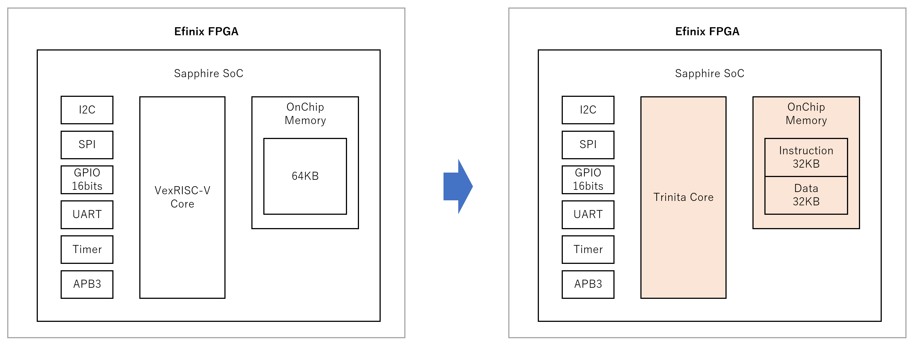
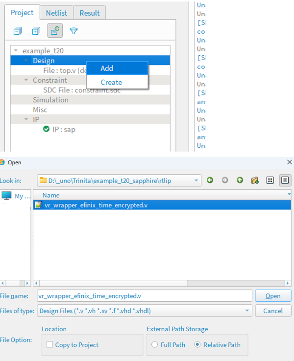
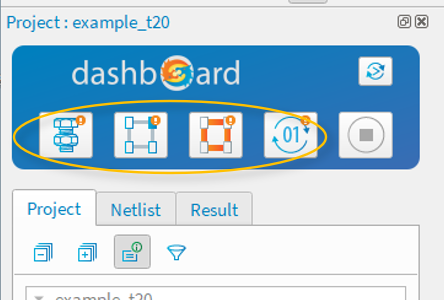

# Trinita 1stage Core

## 注意

- **本ソースコードの使用にあたり [ライセンス](./LICENSE) に同意頂く必要がございます。**
  - 本リポジトリの一部または全部を Clone / Download した時点で、ライセンス条項に同意したものとみなします。
- 本ドキュメントの pdf 版は [こちら](./README.pdf) です。
- 説明用スライド pdf 版は [こちら](./TrinitaTutorial_Slide.pdf) です。
- ソフトウェアを Flash Memory に格納し、Bootloader を使用して起動する方法は下記ドキュメントを参照してください。
  - [Bootloader によるソフトウェアの起動](./README_Bootloader.md)

## 概要

このコアは Efinix FPGA Sapphire SoC 向けの 1ステージ RISC-V コアです。

※2024年3月現在 1 ステージコアの性能向上にともない、2 ステージコアは提供終了となりました。

Efinix Sapphire SoC の Vex RISC-V コアを差し替えて使います。

Efinity の コンパイルパラメータ (VerilogHDL マクロ) 定義によって、下記のオプションを使用できます。

- CPU レジスタ実装方法 : Block RAM または FF の選択



## 動作環境

### ハードウェア

- Efinix 社 Trion FPGA または Titanium FPGA

※後述の Example Design では Trion シリーズ T8 / T20, Titanium シリーズ Ti60 だけに言及していますが、同シリーズの他のデバイスにも実装可能です。

### ソフトウェア

- Efinix 社 Efinity IDE 2023.2~
- Efinix 社 RISC-V IDE 2023.1~
- Python 実行環境

## サンプル

Trinita Core の性能評価用として、各種評価ボード向けの Example Design をご用意しました。

下記フォルダのデザインをダウンロードしてお使いください。

評価ボードですぐに動作確認できる、コンパイル済みのバイナリ (.hex) も同梱しています。

- [T8 Xyloni 用 Example Design](./example_xyloni_1stg)
- [T20 BGA256 Development Board 用 Example Design](./example_t20_1stg)
- [Ti60 F225 Development Board 用 Example Design](./example_ti60_1stg)

## 制約事項

| 項目                 | 内容                                                                            |
| -------------------- | ------------------------------------------------------------------------------- |
| 動作時間             | 無償評価版のみ 1 時間                                                           |
| 動作周波数           | Trion T8 : 12.5 MHz <br> Trion T20 : 25 MHz <br> Titanium シリーズ : 75 MHz |
| オンチップメモリ容量 | Trion T8 : 8KB (imem 4KB + dmem 4KB) <br> Trion T20 : 64KB (imem 32KB + dmem 32KB) <br>  Titanium シリーズ : 64KB (imem 32KB + dmem 32KB) |
| メモリ先頭アドレス   | imem : 0xF900_0000 <br> dmem : 0xF908_0000                                   |

## Sapphire SoC Peripheral 制約事項

### デバッガについて

Trinita では Sapphire SoC の Peripheral をそのまま使えるため、コアを置き換えた後も Sapphire SoC 用のソフトウェアコードをそのまま流用可能です。 <br>
但し、デバッグ(ステップ実行やブレークポイント等) については、Sapphire RISC-V(VexRiscv) で実行してください。<br>

なお、Peripheral として Sapphire SoC ではなく、ウーノラボが提供する UNO Peripheral を使用される場合は、Open OCD を使ったデバッグが可能です。<br>
詳細については弊社 (ウーノラボ) にお問い合わせください。

### Sapphire SoC の設定項目について

2025年2月現在, Sapphire SoC 設定項目のうち下表の設定項目は未サポートです。<br> (将来的にサポートされる可能性があります) <br>
これらの設定項目は OFF にする (チェックを外す) ようにお願いします。

| タブ                 | 未サポートの設定項目                                                            |
| -------------------- | ------------------------------------------------------------------------------- |
| SOC                  | - Cache (Trinita 1stage Core にCacheは不要) <br> - Compressed Extension         |
| Cache/Memory         | - Include the external memory AXI Interface                                     |
| Debug                | - RISC-V Standard Debug <br> - Soft Debug Tap                                   |


## 性能参考値

※ Titanium Ti60 Development Board による測定結果<br>
※ 動作周波数は 75 MHz<br>
※ オンチップメモリ容量は 64KB (imem 32KB + dmem 32KB)<br>

Efinix Sapphire SoC の動作周波数は 20 ~ 400MHz ですが、Trinita Core は実行効率が向上しているため動作周波数を下げています。

動作周波数やメモリ容量のカスタマイズはご相談ください。

#### DMIPS/MHz

※ 当社比の数値です。実装条件によって値は変動します。

| コア             | キャッシュ | DMIPS/MHz |
| ---------------- | ---------- | --------- |
| Efinix VexRiscv  | 無し       | 1.08      |
| Efinix VexRiscv  | 有り       | 1.34      |
| Uno Lab Trinita 1stage CPUレジスタBRAM | 無し       | 1.79      |

#### Efinix FPGA リソース使用量

※ 当社比の数値です。実装条件によって値は変動します。

※ 下表は CPU コアのみの数値であり、実際に使う場合は IMEM, DMEM, Peripheral 等の使用量が追加されます。

※ Ti60 におけるリソース使用量です

| コア             | キャッシュ | CPUレジスタ | FFs  | LTUs  | RAMs |
| ---------------- | ---------- | ----------- | ---- | ----- | ---- |
| Efinix VexRiscv  | 無し       | FF          | 1180 | 1954  | 4    |
| Efinix VexRiscv  | 有り       | FF          | 1502 | 2382  | 16   |
| Uno Lab. Trinita | 無し       | BRAM        | 685  | 2219  | 4    |
| Uno Lab. Trinita | 無し       | FF          | 1675 | 3803  | 0    |

## Trinita 1stage Core 実装 (差し替え) 手順

※ この手順は、下記の前提条件で説明を進めます。

- 既存デザインに Sapphire SoC が実装済みである
- Sapphire SoC のインスタンス名が sap である

※ 置き換え手順は YouTube でも公開しています。あわせて参照下さい。

[](https://youtu.be/nwmNSFLWMqQ)

### 1. テンプレートをコピーする

- template フォルダに格納されているファイル・フォルダを、プロジェクトフォルダにコピーします。
- Sapphire SoC のインスタンス名が sap 以外である場合、templete/embedded_sw/sap 配下のフォルダを、お使いのインスタンス名のフォルダ配下にコピーしてください。

### 2. Sapphire SoC ソースコードの VexRiscV コアを Trinita コアに置き換える

コマンドプロンプトを開き、下記のコマンドを実行します。このコマンドによって、sap.v の VexRiscV コアが Trinita コアに置き換わります。

```
python sap2tri.py ./ip/sap/sap.v
```

### 3. トップデザインにクロックを追加する

1. Efinity を起動して、プロジェクトを開きます。

- Trinita コアは、クロックを 3 本使用します。
  - io_systemClk  : メインクロック
  - io_systemClk2 : メインクロックと同周期の位相をシフトしたクロック
  - io_systemClk3 : メインクロックと同周期の位相をシフトしたクロック
- 位相のシフト順序が io_systemClk -> io_systemClk3 -> io_systemClk2 となるように、PLL の設定を行います。
  - Trion では PLL の位相を細かく設定できないため、Example Design のように VerilogHDL による not 反転記述でクロックを生成しています。
  - Efinix の FF や RAM 等の Primitive には極性 (Polarity) 反転機能が実装されているため、クロックの not 反転記述を使うと、それが有効になります。
    - そのため、not 反転記述を使ってもクロックスキューは増えません。

2. トップデザインの入力ポートとして io_systemClk2, io_systemClk3 を追加します。
3. SoC のインスタンスに io_systemClk2, io_systemClk3 を接続します。
4. Efinity Interface Designer を開き、PLL に io_systemClk2, io_systemClk3 を追加します。

- io_systemClk2, io_systemClk3 の推奨位相は下記のとおりです。
  - Trion T8 12.5 MHz
    - io_systemClk : 0 deg
    - io_systemClk2 : 252 deg
    - io_systemClk3 : 108 deg
  - Trion T20 25 MHz
    - io_systemClk : 0 deg
    - io_systemClk2 : 270 deg  (io_systemClk3 の反転クロック)
    - io_systemClk3 : 90 deg
  - Titanium Ti60 75MHz
    - io_systemClk : 0 deg
    - io_systemClk2 : 225 deg
    - io_systemClk3 : 90 deg

**※ T8 については 125MHz を PLL で生成し、Logic による分周で各クロックを生成することをお勧めします。(PLL のクロック出力本数が足りないため)**

```
    //T8 クロック生成の例
    reg  io_systemClk;
    reg  io_systemClk2;
    reg  io_systemClk3;
    reg [9:0] cntdiv;
    
    (* syn_preserve = "true" *) reg tri_clk_1;
    (* syn_preserve = "true" *) reg tri_clk_2;
    (* syn_preserve = "true" *) reg tri_clk_3;
    
    always@(posedge clk125m)
    begin
      if (~io_pllResetn)
        cntdiv <= 10'b0000011111;
      else
        cntdiv <= {cntdiv[8:0], cntdiv[9]};
    end
    
    always@(posedge clk125m)
    begin
        io_systemClk <= cntdiv[0];
        io_systemClk2 <= cntdiv[7];
        io_systemClk3 <= cntdiv[3];
    end
    
```


5. constraint.sdc に io_systemClk2, io_systemClk3 の定義を追加します。

- お使いのデザイン規模・動作周波数に合わせて、io_systemClk - io_systemClk3 - io_systemClk2 間のデータ受け渡しタイミングがミートするように位相を決定します。
- 何度かコンパイルし、timing report (slack) をチェックして、位相を決定します。

### 4. マクロ定義ファイル(trinita_define.vh) を作成する

1. trinita_define.vh をエディタで開き、下記の通りマクロを定義します。

```verilog
`define EFINIX 1
`define FREQ 25
`define SAPPHIRE 1
`define START_ADDRESS 32'hF9000000
`define IMEM_AWIDTH 15
`define DMEM_AWIDTH 15 
`define FILE_IMEM  "./romdata/imem.hex"
`define FILE_IMEM0 "./romdata/imem0.hex"
`define FILE_IMEM1 "./romdata/imem1.hex"
`define FILE_IMEM2 "./romdata/imem2.hex"
`define FILE_IMEM3 "./romdata/imem3.hex"
`define FILE_DMEM  "./romdata/dmem.hex"
`define FILE_DMEM0 "./romdata/dmem0.hex"
`define FILE_DMEM1 "./romdata/dmem1.hex"
`define FILE_DMEM2 "./romdata/dmem2.hex"
`define FILE_DMEM3 "./romdata/dmem3.hex"

//デバイスの選択。どちらかを有効にする。
`define TRION 1
//`define TITANIUM 1

```

2. プロジェクトに ./rtlip/vr_wrapper_efinix_time_encrypted.v を追加します。



3. トップデザインに下記の 1 行を追加します。

```verilog
`include "trinita_define.vh"
```

### 5. RISC-V IDE でソフトウェアを Trinita 用にビルドする

1. RISC-V IDE を起動したら、ワークスペースとして ./embedded_sw/sap を指定します。
2. gpioDemo_trinita プロジェクトをインポートします。
3. gpioDemo_trinita/build 配下に imem.bin と dmem.bin が出力されます。
4. コマンドプロンプトを開き, Efinity Project にカレントディレクトリを移動し、次のコマンドを実行します。 これで romdata/ 配下に imem と dmem の RAM 初期値ファイルが生成されます。

```
python conv_tri_mem.py ./embedded_sw/sap/software/standalone/gpioDemo_Trinita/build
```


### 6. Efinity でコンパイルする

Efinity でコンパイルを実行します。



---

## 問い合わせ先

|                                          | リンク先                                                                           |
| ---------------------------------------- | ---------------------------------------------------------------------------------- |
| Trinita IP コア 開発元・技術問い合わせ   | [株式会社ウーノラボ ](https://www.unolabo.co.jp/)                                     |
| Efinix FPGA / 評価ボードのオンライン購入 | [コアスタッフ Efinix製品ページ](https://www.zaikostore.com/zaikostore/special/EFINIX) |
| Efinix FPGA 取扱代理店                   | [加賀デバイス株式会社](https://www.kgdev.co.jp/category/column/efinix/)               |
