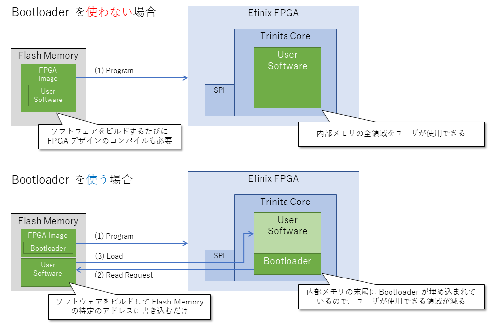
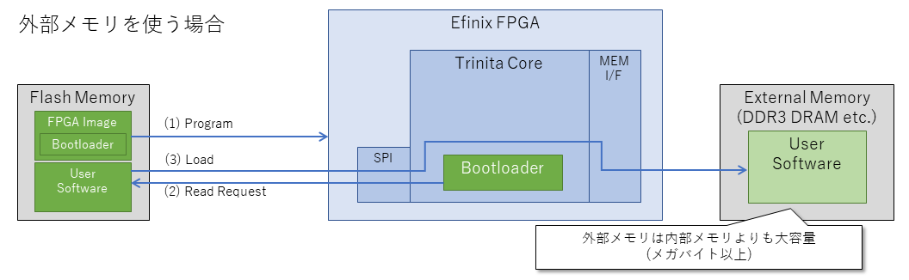
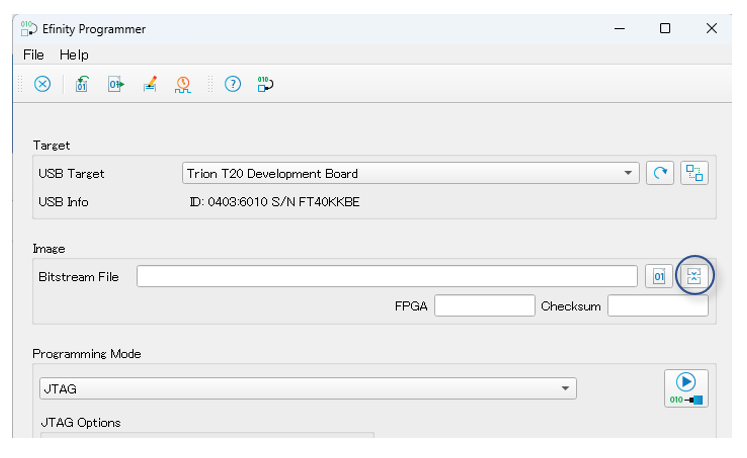
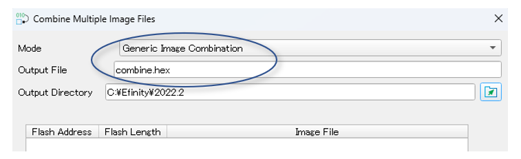
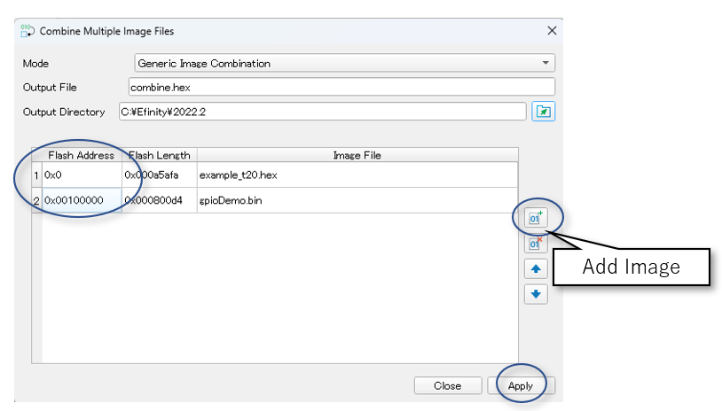
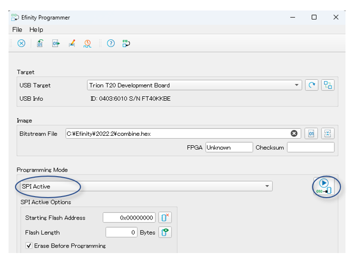
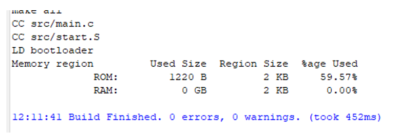

# Bootloader によるソフトウェアの起動

## 概要

下記 Example Design では、Trinita Core に Bootloader が実装されています。

- [T20 BGA256 Development Board 用 1 ステージ Bootloader Example Design](./example_t20_1stg_bootloader)
- [Ti60 F225 Development Board 用 1 ステージ Bootloader Example Design](./example_ti60_1stg_bootloader)

ユーザは、ソフトウェアを Flash Memory の特定のアドレスに書き込むことで、FPGA デザインをコンパイルすることなく、ソフトウェアを差し替えることができます。

このページではソフトウェアのビルド方法、Bootloader の変更・ビルド方法について説明します。

本ドキュメントの pdf 版は [こちら](./README_Bootloader.pdf) です。





**※ Bootloader と外部メモリを使用すると、より大容量のソフトウェアを実行できますが、2024年3月現在、外部メモリは未対応です。将来対応予定です。**




## 注意点

- FPGA イメージのサイズが 1MB (0x100000) 未満である前提で説明しています。
  - サイズが 1MB を超える場合は、Bootloader のソフトウェアロード設定 / Flash Memory 配置場所の変更が必要です。

## 動画

[](https://youtu.be/0-CccOJGw-A)


## Example Design の仕様


### 命令メモリ (imem) の割り当て

| アドレス  | 領域   |
| ------ | ------ |
| 0xF9000000 | ユーザソフトウェア |
| ~ | ~ |
| 0xF90077FF | |
| 0xF9007800 | Bootloader |
| ~ | ~ |
| 0xF9007FFF | |


### データメモリ (dmem) の割り当て

| アドレス  | 領域   |
| ------ | ------ |
| 0xF9080000 | ユーザソフトウェア |
| ~ | ~ |
| 0xF90877FF | |
| 0xF9087800 | Bootloader |
| ~ | ~ |
| 0xF9087FFF | |

### Flash Memory の割り当て

| アドレス  | 領域   |
| ------ | ------ |
| 0x00000000 | FPGA イメージ |
| ~ | ~ |
| 0x000FFFFF | |
| 0x00100000 | ユーザソフトウェア |
| ~ |  |

## ユーザソフトウェアのビルド手順

FPGA デザインをコンパイルせずに、ユーザソフトウェアをビルドし、そのバイナリを Flash Memory に書き込む方法を説明します。

### 1. コーディングする

### 2. リンク設定 (.ld) を編集する

./embedded_sw/sap/bsp/efinix/EfxSapphireSoc/linker/link-trinita.ld を開きます。

下記のように、ユーザソフトウェアの配置場所 (命令メモリ / データメモリのアドレス) とサイズが定義されています。

もし、Bootloader の配置場所 / サイズを変更する場合は編集してください。

Bootloader を変更しない場合は編集不要です。

```
OUTPUT_ARCH( "riscv" )

ENTRY( _start )

MEMORY
{
  rom  (rx) : ORIGIN = 0xF9000000, LENGTH = 30K
  ram  (wxai!r) : ORIGIN = 0xF9080000, LENGTH = 30K
}

PHDRS
{
  rom PT_LOAD;
  ram PT_LOAD;
}

SECTIONS
{
  __stack_size = DEFINED(__stack_size) ? __stack_size : 8192;

  . = 0xF9000000;
  .rom_section.init           :
  {
    KEEP (*(SORT_NONE(.init)))
  } >rom AT>rom :rom

  .rom_section.text           :
  {
    *(.text.Proc_1);
    *(.text.Proc_2);
    
    (以下略)
```


### 3. ビルドする

### 4. Flash Memory に書き込む

ビルドして生成されたバイナリファイルを FPGA イメージ (hex) に結合して、Flash Memory に書き込みます。

1. Efinity Programmer を起動します。

2. Combine Multiple Image を押下します。



3. Mode を "Generic Image Combination" に変更し、Output File に出力するファイル名を入力します



4. 右側の Add Image ボタンを押下し、FPGA イメージとソフトウェアのバイナリを追加します。

※ FPGA イメージは outflow/ フォルダ配下の ***.hex** ファイルです。

※ ソフトウェアバイナリは、RISC-V IDE プロジェクト配下の ***.bin** ファイルです。


5. FPGA イメージとソフトウェアのバイナリを追加したら、Flash Address を図のように変更します。

※ アドレスは [[Flash Memory の割り当て]](#flash-memory-の割り当て) に合わせる

6. 変更完了後 Apply を押下します。




7. Programming Mode を SPI Active に変更し、Start Program を押下します。



## Bootloader のビルド手順

Example Design では Bootloader のビルドは不要です。

もし Bootloader を変更する場合は下記の手順を実行してください。

### 1. Bootloader をコーディングする

./embedded_sw/sap/bsp/efinix/EfxSapphireSoc/app/bootloaderConfig.h を開きます。

下記のようにユーザソフトウェアの配置場所 (命令メモリ / データメモリのアドレス) とサイズ、Flash Memory の格納場所(アドレス) が定義されていますので、適宜変更してください。

```cpp
#define USER_SOFTWARE_MEMORY_INST 0xF9000000
#define USER_SOFTWARE_FLASH_INST  0x00100000
#define USER_SOFTWARE_SIZE_INST   0x7800

#define USER_SOFTWARE_MEMORY_DATA 0xF9080000
#define USER_SOFTWARE_FLASH_DATA  0x00100000 + ( USER_SOFTWARE_MEMORY_DATA - USER_SOFTWARE_MEMORY_INST )
#define USER_SOFTWARE_SIZE_DATA   0x7800
```


### 2. リンク設定 (.ld) を編集する

./embedded_sw/sap/bsp/efinix/EfxSapphireSoc/linker/bootloader-trinita.ld を開きます。

下記のように Bootloader の配置場所 (命令メモリ / データメモリのアドレス) とサイズが定義されていますので、適宜変更してください。

```
OUTPUT_ARCH( "riscv" )

ENTRY( _start )

MEMORY
{
  rom  (rx) : ORIGIN = 0xF9007800, LENGTH = 2K
  ram  (wxai!r) : ORIGIN = 0xF9087800, LENGTH = 2K
}

PHDRS
{
  rom PT_LOAD;
  ram PT_LOAD;
}

SECTIONS
{
  __stack_size = DEFINED(__stack_size) ? __stack_size : 1024;

  . = 0xF9007800;
  .rom_section.init           :
  {
    KEEP (*(SORT_NONE(.init)))
  } >rom AT>rom :rom
  
  (以下略)
```

### 3. ビルドする

RISC-V IDE で bootloader のプロジェクトをインポートし、ビルドしてエラーが発生しないことを確認します。

※ プロジェクトは ./embedded_sw/sap/software/standalone/bootloader_Trinita です。




### 4. Bootloader を FPGA イメージに埋め込む

1. ビルドして生成された imem.bin / dmem.bin を ./romdata 配下にコピーします。

2. ./romdata 配下の bin2hex_bootloader.bat を編集します。

imem / dmem それぞれの先頭アドレスと、bootloader 領域のアドレスを python スクリプトに与えています。

```bat
python .\trinitaHexGen.py .\imem.bin 0xF9000000 0xF9007800
python .\trinitaHexGen.py .\dmem.bin 0xF9080000 0xF9087800
```

3. bin2hex_bootloader.bat を実行します。

これで FPGA イメージに埋め込む内部 RAM の hex ファイルが生成されます。


### 5. .vh ファイルを編集する

trinita_define.vh を開きます。

START_ADDRESS を imem の bootloader 領域の先頭にセットします。

```verilog
// 省略

`define START_ADDRESS 32'hF9007800

// 省略
```


### 6. FPGA デザインをコンパイルする

Efinity で FPGA デザインを開き、コンパイルします。

コンパイル完了後は [3. Flash Memory に書き込む](#3-flash-memory-に書き込む) の手順にそって、FPGA イメージとユーザソフトウェアを結合して、Flash Memory に書き込みます。


